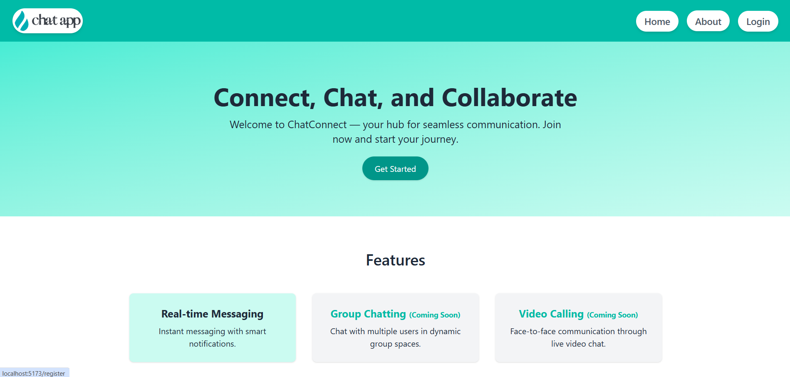
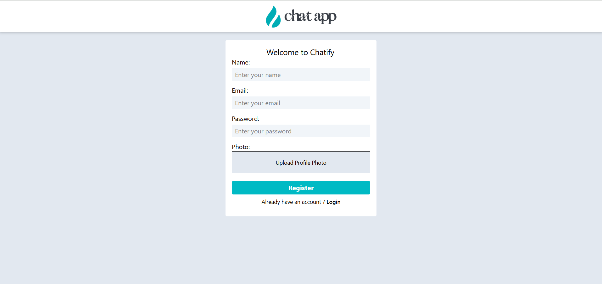
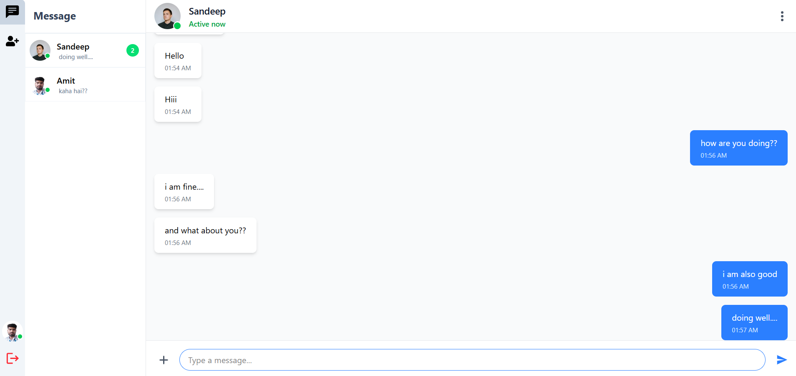
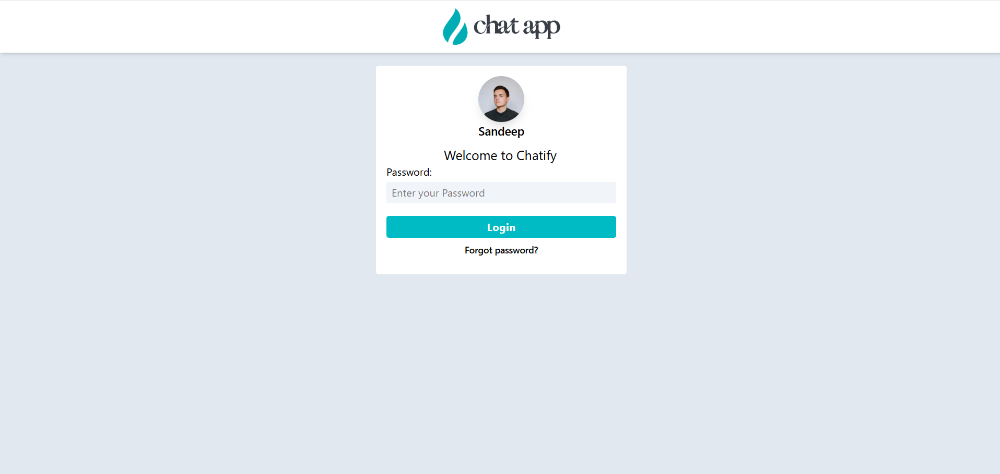
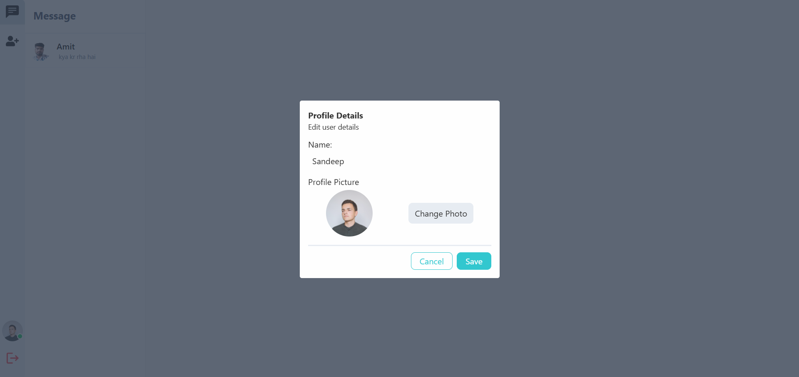

# 💬 Real-Time Chat App

A full-stack real-time chat application built using **React + Vite** on the frontend and **Node.js + Express** on the backend. It supports user authentication, one-on-one messaging, and is designed to be scalable with planned support for video calling, group chats, and premium features in future updates.

---

## 🚀 Features

- 🔒 User Authentication (Login & Signup)
- 💬 Real-time Messaging using WebSockets
- 🧠 Smart UI built with Tailwind CSS
- 📱 Responsive Design (Mobile & Desktop)
- 🧩 Scalable Architecture
- 🌊 Aqua-themed UI for a modern, clean look

---

## 🧱 Tech Stack

### Frontend:
- [React](https://reactjs.org/)
- [Vite](https://vitejs.dev/)
- [Tailwind CSS](https://tailwindcss.com/)
- [React Router](https://reactrouter.com/)

### Backend:
- [Node.js](https://nodejs.org/)
- [Express](https://expressjs.com/)
- [WebSocket (Socket.io)](https://socket.io/) 
- [MongoDB](https://www.mongodb.com/)
- [Cloudinary](https://www.cloudinary.com/)

---

## 📦 Installation & Setup
### 📂 Frontend Setup (React + Vite)
- cd client
- npm install
- npm run dev
### ⚙️ Backend Setup (Node.js)
- cd server
- npm install
- npm run dev

### Clone the Repository
 
 - git clone https://github.com/your-username/chat-app.git
 - cd chat-app

### ScreenShots

### 📬 Contribution
Contributions are welcome! Please fork the repository and open a pull request.

### 📄 License
This project is licensed under the MIT License.

### 🔗 Connect
- 🆔GitHub: sandipmavi
- 📧Email: smavi.dev@gmail.com
